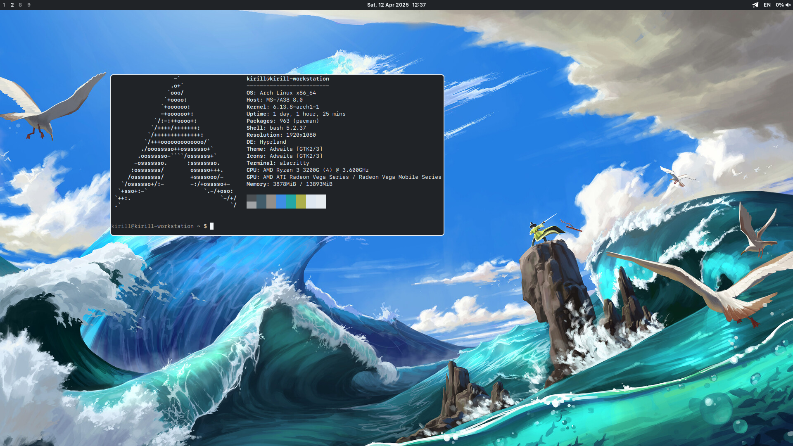

# Software
- **WM**: Hyprland
- **Shell**: `bash`
- **Terminal**: `alacritty`
- **Bar**: `waybar`
- **Application launcher**: `rofi` (Wayland fork)
- **File manager**: `thunar`
- **Image viewer**: `imv`
- **Screenshots**: `grim` + `slurp` + `satty`
- **Color picker**: `hyprpicker`
- **"pywal"**: `wallust`
- **Notification daemon**: `mako`
- **Day/night color correction**: `wlsunset`
- **Wallpaper daemon**: `swww`
- **GTK theme selector**: `nwg-look`
- **Policy kit**: `polkit-gnome`
- **Clipboard history**: `cliphist`

See full package lists (essential, optional) in [`.github`](.github) directory.

# Installation
Set up an alias and clone the repo (assuming you use `bash`):
```bash
echo 'alias dotfiles="/usr/bin/git --git-dir=$HOME/.dotfiles/ --work-tree=$HOME"' >> $HOME/.bashrc
source ~/.bashrc
echo ".dotfiles" >> .gitignore
git clone --bare https://www.github.com/kitrofimov/dotfiles.git $HOME/.dotfiles
dotfiles checkout
dotfiles config --local status.showUntrackedFiles no
```

Install essential packages; you may also install optional packages the same way ([`packages-optional.txt`](packages-optional.txt) and [`packages-optional-aur.txt`](packages-optional-aur.txt)).
```bash
sudo pacman -S --needed - < ~/.github/packages-essential.txt
yay -S --needed - < ~/.github/packages-essential-aur.txt
```

Done! Launch your [display manager](https://wiki.archlinux.org/title/Display_manager) and enter Hyprland session, or just type `Hyprland` in a TTY.
